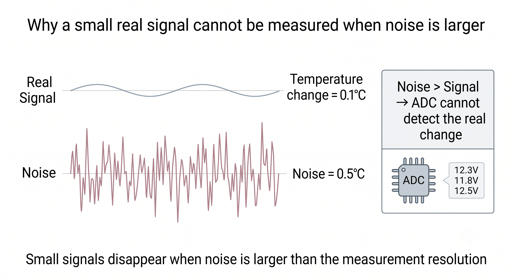

# **3.5 Signal Integrity**

Signal Integrity คือความสามารถของสัญญาณในการ “เดินทางจากต้นทางไปยังปลายทาง” โดยยังคง **รูปแบบ**, **ขนาด**, และ **ความถูกต้อง** ไม่ผิดเพี้ยนไปจากสิ่งที่ต้องการวัดจริง

ในระบบวัดและควบคุม (Measurement & Control System) ความสมบูรณ์ของสัญญาณเป็นพื้นฐานสำคัญ เพราะข้อมูลที่ผิดเพี้ยนเพียงเล็กน้อยสามารถทำให้ระบบตัดสินใจผิดพลาดได้ทันที เช่น อ่านอุณหภูมิผิด, ควบคุมมอเตอร์ผิดตำแหน่ง, หรือทำให้ระบบความปลอดภัยทำงานผิดจังหวะ

ดังนั้น Signal Integrity ต้องถูกออกแบบ **ตั้งแต่ต้นทาง** คือที่เซนเซอร์ ไม่ใช่รอแก้ตอนปลายทางที่ ADC หรือไมโครคอนโทรลเลอร์

## **สิ่งที่ทำลาย Signal Integrity**

### **1. Noise (สัญญาณรบกวน)**

Noise คือสัญญาณที่ไม่ต้องการซึ่งแทรกเข้ามาในสัญญาณจริง ทำให้ค่าที่อ่านได้แกว่งหรือผิดเพี้ยน

**แหล่งกำเนิด Noise ที่พบบ่อย**
- อุปกรณ์ไฟฟ้าที่มีการสวิตช์: มอเตอร์, relay, solenoid
- สายไฟ AC ที่อยู่ใกล้กัน
- สัญญาณ RF: Wi‑Fi, Bluetooth, โทรศัพท์มือถือ
- Switching power supply

**ผลกระทบ**
- ค่าที่อ่านแกว่งขึ้นลง
- ทำให้ ADC อ่านค่าผิด
- ทำให้ระบบควบคุมตอบสนองผิดจังหวะ

**แนวทางแก้ไข**

- ใช้ **capacitor** กรองสัญญาณ (low‑pass filter)
- ใช้ **shielded cable**
- แยกสายสัญญาณออกจากสายกำลัง
- วางเซนเซอร์ให้ห่างจากแหล่งกำเนิดรบกวน

### **2. Ground Loop (วงจรกราวด์)**

เกิดขึ้นเมื่อมีกราวด์หลายจุดที่มีศักย์ไฟฟ้าไม่เท่ากัน ทำให้เกิดกระแสไหลวนในเส้นกราวด์

**ผลกระทบ**
- เกิด noise แบบความถี่ต่ำ (hum)
- สัญญาณอนาล็อกเพี้ยนโดยไม่รู้ตัว
- อุปกรณ์บางชนิดทำงานผิดพลาด

**แนวทางแก้ไข**
- ใช้ **single‑point grounding**
- ใช้ **isolated power supply**
- แยกกราวด์สัญญาณออกจากกราวด์กำลัง
    

### **3. Voltage Drop (แรงดันตก)**

เกิดจากสายไฟยาวหรือมีความต้านทานสูง ทำให้แรงดันที่ปลายทางต่ำกว่าที่ต้นทางส่งมา

**ผลกระทบ**
- เซนเซอร์ทำงานผิดช่วง
- สัญญาณที่ส่งกลับไมโครคอนโทรลเลอร์เพี้ยน
- อุปกรณ์บางชนิดไม่ทำงานหรือทำงานไม่เสถียร

**แนวทางแก้ไข**
- ใช้สายไฟที่มีหน้าตัดใหญ่ขึ้น
- ลดความยาวสาย
- ใช้ **buffer amplifier** เพื่อขับสัญญาณให้แรงขึ้น

### **4. Crosstalk (สัญญาณรั่วไหล)**

เกิดจากสัญญาณในสายหนึ่งเหนี่ยวนำไปยังอีกสายหนึ่ง โดยเฉพาะเมื่อสายวางคู่กันเป็นระยะทางยาว

**ผลกระทบ**
- สัญญาณอนาล็อกเพี้ยน
- ADC อ่านค่าผิด
- สัญญาณดิจิทัลเกิด error

**แนวทางแก้ไข**
- เว้นระยะห่างระหว่างสาย
- ใช้ **twisted pair**
- ใช้ **shielding**

## **หลักการออกแบบเพื่อรักษา Signal Integrity**

### **1) ออกแบบให้ดีตั้งแต่ต้นทาง (Sensor Stage)**

- เลือกเซนเซอร์ที่มีสัญญาณออกเหมาะสม (แรงดัน, กระแส)
- วางตำแหน่งเซนเซอร์ให้ห่างจากแหล่งรบกวน
- ใช้แหล่งจ่ายไฟที่สะอาด
- ใส่ **decoupling capacitor** ใกล้เซนเซอร์

### **2) Signal Conditioning ที่ดี**

ก่อนส่งสัญญาณไปยัง ADC ควรปรับสัญญาณให้เหมาะสม

- **Amplify** สัญญาณให้มีขนาดเพียงพอ
- **Filter** noise ตั้งแต่ต้นทาง
- ใช้ **shielded cable** หากต้องส่งสัญญาณไกล

### **3) เข้าใจข้อจำกัดของ ADC**

ADC ไม่สามารถแก้ปัญหา noise ให้หายไปได้ หาก noise เข้ามาตั้งแต่ต้นทาง

ข้อจำกัดที่ต้องรู้:
- **Resolution** (8‑bit, 10‑bit, 12‑bit)
- **Input range** (0–3.3V, 0–5V)
- **Sampling rate**
- **Noise floor** ของ ADC เอง

หากสัญญาณมี noise มากกว่า “ความละเอียด” ของ ADC → อ่านค่าไม่แม่นยำ

## **ตัวอย่างง่าย ๆ ที่เห็นภาพทันที**

- ถ้าอุณหภูมิเปลี่ยน **0.1°C**
- แต่มี noise **0.5°C**
→ ระบบจะไม่สามารถวัดการเปลี่ยนแปลง 0.1°C ได้เลย เพราะ noise ใหญ่กว่าสัญญาณจริง

หรือในกรณี ADC:
- ADC 10‑bit → 0–1023
- แต่สัญญาณแกว่ง ±10 จาก noise

→ ความแม่นยำลดลงทันที แม้เซนเซอร์จะดีมากก็ตาม

